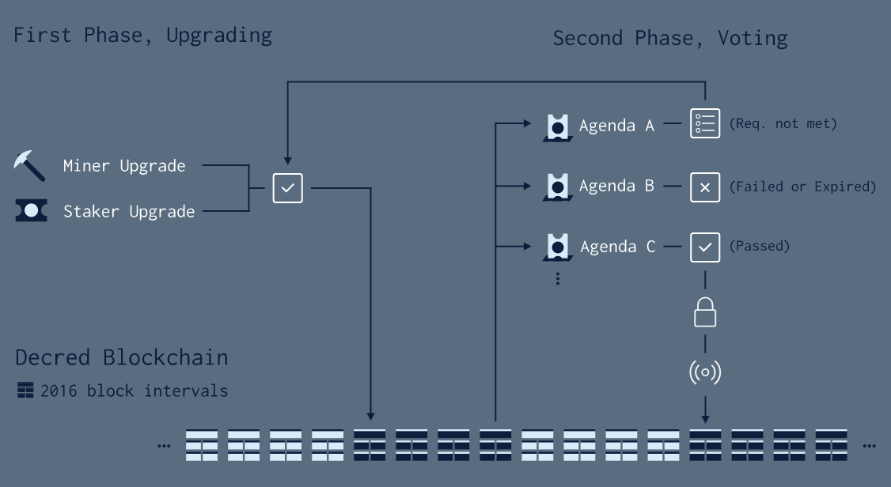

# Decred 链上共识变更流程

####这分成两个阶段来处理实施共识变更（创建一个硬分叉情形）的投票。

首先，请注意Decred区块链专门为投票过程指定了两个不同的区块间隔：2016个区块（约1周）一个权益版本间隔（SVI）和8064个区块（约4周）一个规则变更间隔（RCI），1个规则变更间隔（RCI）里包含4个权益版本间隔（SVI）。

投票过程的第一步是满足网络升级的门槛。在硬分叉代码被释放后（例如v1.0.0中的sdiff算法改变），参与PoW / PoS网络上的大多数节点需要在投票
计划开始前先进行升级。对于工作量证明POW，1000个最近的区块中至少有95％必须有最新的区块版本。对于权益证明POS，单个SVI中75%的已投投票必须有最新的投票版本。一旦矿工和选民升级门槛得到满足，投票计划从下一个RCI的第一个区块开始（由于每1个RCI有4个SVI，下一个RCI开始可能需要6048个区块[3个SVI ]）。

投票过程的第二步是实际投票。单个RCI产生时最多可以投出40320票。选票数在RCI的最后一个区块进行统计，结果在下一个区块被开采之前确定。
有一些可能的投票结果：
1. 如果RCI内所有选票中有超过90％是“弃权”选票，议案投票仍然在下一个RCI中有效。
2. 如果RCI内的所有非弃权票未达到75％是“是”或“否”多数门槛，议案投票仍然在下一个RCI有效。
3. 如果RCI内所有非弃权票的75％支持议案（“是”），则议案被视为锁定，共识变更将激活在投票通过后8064个区块。
4. 如果RCI内所有非弃权票的75％都反对议案（“否”），议案就会失败，并且共识变更将不会启动。
5. 如果议案在其投票期限内没有达到75％的多数投票，议案将过期，并且共识变更将不会启动。

以下是共识升级单个议案的整个周期的图示：

######文章来源[简要介绍链上共识投票如何工作及流程​](https://www.dcr66.com/threads/61/)