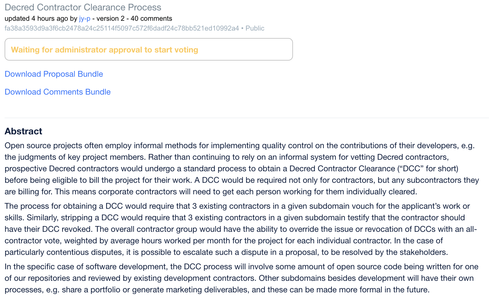

# 新提案讨论 
### Decred Contractor Clearance Process -- *by jy-p*
 
 

这是有 jy-p 提出的 Decred 承包商的管理体制。

目前Decred的 招聘过程 都是要求有兴趣参与的人先自发参与，完成工作后提交工作结果审核批准。慢慢建立了诚信后再列入队伍中。

而jy-p这次提出的 Decred Contractor Clearance （DCC） 就是让有兴趣参与Decred工作的人，只需要有 3个合格承包商担保新人有相关工作需要的技能即可。相同的，撤掉承包商资格也只需要3个合格承包商投票撤除。

这提案将让整个DCR 项目更去中心化，在承包商管理 及 质量控制方面 权利不再集中于几个团队成员。

在这个承包商管理系统上线后，目前所有承包商将自动获得 DCC。其中jake提出了在7个月内的3个里程碑奖励 分别为 5000，5000，及2000。

整个管理系统预算 需 25,000 美金的开发费用及12,000 的奖金。

提案里也提出了几个领导此提案开发的人选，包括 Sean Durkin, Marco Peereboom, Alex Yocom-Piatt and Luke Powell. 其他愿意加入的开发员也可以提案通过后参与。

详情及社区有趣的讨论请参考**[原讨论区](https://proposals.decred.org/propos...78a24c25114f5097c572f6dadf24c78bb521ed10992a4)**

### 关于作者 
Guang

意见欢迎联系 
[Medium](https://medium.com/@guang.dcr) 
Telegram: @GuangGuang 
Matrix: @guang:decred.org
