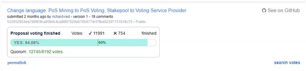
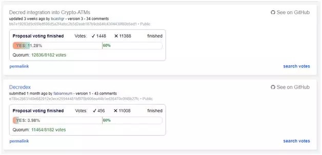
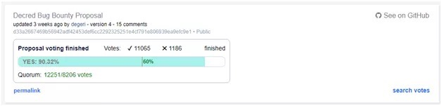

# DCR的链上治理了解一下
*原创:[比特币女博士](https://weibo.com/u/2811910187) 引用自：https://mp.weixin.qq.com/s/z3hzILiPBsLJR72Q2tP7TQ
2018-12-30*

Decred的Politeia系统已经上线了两个多月了。这个提议+投票系统将会是今后所有链上治理的平台，它集成了提交议题，跟踪议题，讨论议题，以及通过持币者投票最终决定是否通过议题的功能。议题可以包括改变或改进现有的DCR协议，也可以是决定如何使用分配DCR的项目基金（持有570000DCR，价值超过一千万美金）。整个系统抵抗审查能力也相当强大，同时也有过滤垃圾信息的能力。Politeia的持续运行可以说使项目开发者和社区之间找到了其他项目所不能比拟的平衡与透明度。现在这个系统上线两个月，从投票热度上来看基本上每个议题不管是同意还是反对，加起来都能达到一万票以上，和目前的流通量相比可以说热度还是不错的（超过15%的社区在积极参与每个议题）。那今天我们就来看看DCR这个主打链上治理的公链在这两个月期间都治理了哪些问题。

第一个通过的议题是改变PoS挖矿的说法转为PoS投票，然后把PoS矿池改为投票服务提供商。这个议题毫无悬念通过。

第二个议题是使用项目基金支持一些开源研究项目。但具体如何实行还没有决定，这个束缚力与资金需求暂时还不明朗的议题也通过了。不过个人感觉这个议题比较鸡肋，没什么干货。

这两个议题就非常有意思了。两个在币圈比较有名的公关公司Ditto和Wachsman分别提出想代理DCR的公关宣传工作。投票期间加了DCR群的朋友相信都看到了两边拉票的行为。因为这个服务是要收费的，两边的报价差不多都是两万多美金一个月。最后Ditto以微弱的优势过了60%的线。到底这个阶段花这么多钱去搞公关和宣传是不是头等大事，每个人都有自己的看法，但公平的治理就是这样少数服从多数以获得最高的效率。

很多人也发表了反对的声音：
比如“PRcompanies and the whole same old corporate shebang is not what I signed up forwhen I first discovered crypto. I would rather put the $20k somewhere else.”

“我一开始接触加密货币的时候并没有想到要和公关公司和整个这种老旧的公司体系打交道，我宁愿把这两万一个月花在其他地方
“Ialso believe we should look for dedicated people not for mercenaries. If wereally want to do some PR, my proposal is that we should look for dedicatedpeople working exclusively for Decred. They should eat and bread Decred andnothing else.”

“我觉得我们应该需要专用的宣传人员而不是这种雇佣兵。如果我们需要真正的宣传，我的提议是寻找专用人员只对DCR负责。”

 Ditto的这个提议最终有两万多张票参与，是目前为止最多投票的一个议题。当然这个系统也有一些比较垃圾的提议想来分一杯项目基金的羹的。比如这个提议想在广播频道上宣传，收费两万美金：
 

没有通过。
这个垃圾小交易所想用项目基金来交上币费的：
DCR从来没有付过一分钱上币费（币安，火币都是主动上币）。这当然没有通过。
还有说要加进ATM和开发DEX的，通通被否决了

可以说politeia的自我过滤能力非常出众，想来骗钱的只能白白浪费提议费。
最近这个通过的提议我觉得非常有价值：

这个是基于DCR的漏洞赏金计划。这个和以太的https://bounty.ethereum.org/ 赏金计划非常类似。直接高票通过。提议者还列出了完整的解决漏洞流程以及漏洞危险程度评级。这种提议算是把项目基金用到了刀刃上。

总的来说Politeia的实际运行和理想情况并没有什么差距，PoS这种模式就是谁币多谁的话语权就强，我对DCR的未来还是很有信心的。你给Politeia打几分呢？

  

